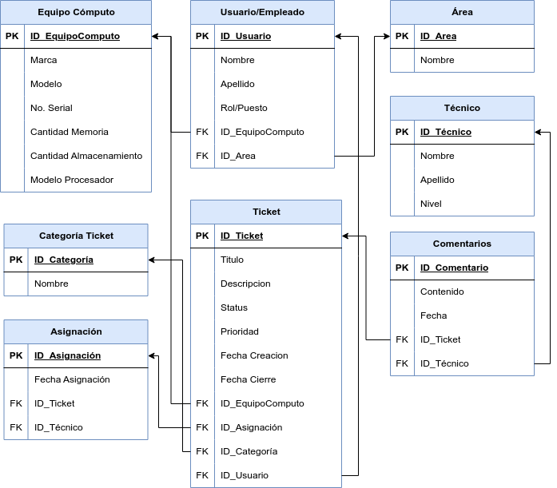

# Sistema de Tickets de Soporte Técnico

## 1. Descripción del Problema y Requerimientos

La empresa Equilibra S.A de C.V ofrece sus servicios de consultoría química, manejo de desechos químicos y de verificaciones 
de cumplimiento de las N.O.M. Al tener aproximadamente 30 empleados, es una PYME, por lo que no cuenta con un departamento de TI propio. 
Esto lleva a que Equilibra S.A de C.V rente servicios de este tipo a terceros. En particular, renta un servicio de tickets de Soporte 
Técnico para el mantenimiento y/o reparación del equipo de cómputo de la empresa.

La empresa Sudo Services es la empresa que provee servicios de TI a Equilibra S.A de C.V. Para cumplir con las necesidades de 
la empresa, el sistema de tickets cuenta con una base de datos que almacena información sobre:

- Equipos de cómputo de la empresa
- Usuarios que usan los equipos
- Áreas a las que pertenecen
- Tickets creados por los usuarios
- Técnicos encargados de resolver los tickets
- Categorías de los tickets

## 2. Modelo Relacional del Sistema




## 3. Implementación del Sistema

El esquema está implementado en MySQL pero es compatible con sistemas MariaDB.
Se incluye una carpeta _.dbeaver_ con la información del proyecto para el SMBD
DBeaver. 

## 4. Funcionalidades Implementadas

### Triggers

- **NoCierreNoAsignacion**: Validación de un ticket para que no pueda cerrarse sin asignación. De esta forma, el trigger se dispara antes de actualizar un ticket, analizando si el estado nuevo del ticket es "cerrado" y que no exista alguna asignación para el ticket, si se cumplen ambos criterios se lanza una excepción.

- **TecnicoAsignadoComentarios**: Trigger que valida que solo el técnico asignado a un ticket pueda hacer comentarios, por lo que se dispara antes de insertar un comentario. El trigger analiza si el técnico que está intentando insertar el comentario es el técnico asignado al ticket. En caso contrario, se lanza una excepción de ejecución.

### Procedimientos Almacenados

- **CambiarEstadoTicket**: Procedimiento para actualizar el estado de un ticket especificado.
    El procedimiento toma dos parámetros, el ID del Ticket a modificar y el nuevo estado del mismo. Es importante recalcar que el estado del ticket solo puede ser 'Abierto', 'En Proceso' o 'Cerrado'. De no ingresar un estado o un ID válido, el proceso termina con erro de ejecución. Para usarlo, se puede hacer una llamada como la siguiente: 

    ```sql
    CALL CambiarEstadoTicket(1, 'En Proceso');
    ```
- **AsignarTicket**: Procedimiento que asigna un ticket a un técnico específico. Este procedimiento valida que un técnico pertenezca al área del ticket. Toma el parámetro ID del ticket e ID del técnico. Si el ID del técnico pertenece al área, entonces entrará "en proceso", si no es así, el proceso terminará con una ejecución errónea
    ```sql
        CALL AsignarTicket(1, 2);
    ```
- **AgregarComentario**: Procedimiento para agregar un comentario a un ticket específico.
    Este procedimiento toma de parámetros el ID del ticket y luego el comentario sobre el mismo. Si el ID insertado no corresponde a un ticket existente, el proceso termina con una ejecución errónea. Se usa de la siguiente manera: 

    ```sql
    CALL AgregarComentario(1, 'Se ha iniciado el proceso de revision.');
    ```

### Vistas

- **TicketsActivos**: Vista para revisar la información sobre los tickets activos sin importar su prioridad.
- **TicketsCerrados** : Vista para revisar la información sobre los tickets cerrados sin importar su prioridad.
- **TicketsActivosAltaPrioridad** : Vista para revisar la información sobre los tickets activos con alta prioridad.
- **TicketsActivosMediaPrioridad**: Vista para revisar la información sobre los tickets activos con prioridad media.
- **TicketsActivosBajaPrioridad**: Vista para revisar la información sobre los tickets activos con prioridad baja.
- **AsignacionTicketsAbiertos**: Vista para revisar las asignaciones a técnicos sobre tickets abiertos.
- **AsignacionTicketsCerrados**: Vista para revisar las asignaciones a técnicos sobre tickets cerrados.

Para ejecutar cualquiera de las vistas, se sigue el siguiente formato: `SELECT * FROM <NombreDeLaVista>`. Por ejemplo: 

```sql
SELECT * FROM TicketsActivos;
```

## Funciones

- **ContarTicketsPorEstado**: Función que cuenta el número total de tickets que tienen un estado específico. Toma de parámetro el estado de los tickets a revisar y regresa un entero significando la cantidad de tickets en dicho estado. Se usa de la siguiente manera:

```sql
SELECT ContarTicketsPorEstado('Abierto');
```

## 5. Forma de Ejecución

Para poder formar el esquema de forma correcta se ejecutan los archivos ubicados en _Scripts_ de la siguiente manera: 
- [Esquema.sql](Scripts/Esquema.sql)
- [FuncionesYProcedimientos.sql](Scripts/FuncionesYProcedimientos.sql)
- [Triggers.sql](Scripts/Triggers.sql)
- [Vistas.sql](Scripts/Vistas.sql)
- [ControlDeUsuarios.sql](Scripts/ControlDeUsuarios.sql)
- [Inserts.sql](Scripts/Inserts.sql)

El último archivo funge como el diccionario de datos del sistema. 